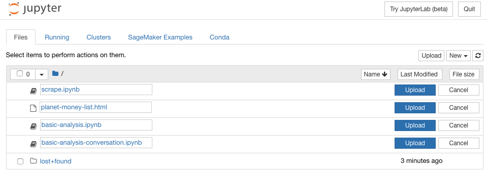

# Planet Money - Podcast Generator

trained text-generating neural network that generates episodes of [Planet Money](https://www.npr.org/sections/money/)

## Audio Example

[Planet Money RNN - Example 01](https://soundcloud.com/gloverdude/planet-money-rnn-example-01)

## Learning Example (10 epoch spread)

* **KESTENBAUM**: The the the the the the the the the the the the the the the and a pount and the the the the the the the the the the the the the the the the the to the the the the the the the the the the the the the the the the the the the the the the the the the cong the the the cont and the the the

* **SMITH**: hat the the the the the the and the the the the wat the the the the the the the the the the the that the the the wall the the the the the the the the the the the the wale in the and of the the the the the the to the the the the the the the the the the the the the the the the

* **KESTENBAUM**: And the Norwegian far a proble is a lot of the oil curse. It some of the to get the oil companies in the money and the oil curse. The economy something the oil curse is a lot of the oil curse. The economy gooked the government of the tough to be a cable that the oil curse in the oil co

* **SMITH**: Year as a country we story and the tough that the oil companies in the oil curse. And they don't know the resourt of the oil curse. The is a sayy for a country what the oil curse. The is not to the Norwegian the resourt in the oil curse. It's set it the resournd and what the to get the oil

* **KESTENBAUM**: And in an additional should be 1 percent.

* **SMITH**: Yeah. And it's a little bit is the oil curse is a half and seement the oil curse. The end of that the resource curse.

* **KESTENBAUM**: That's like a 50 percent error or something.

* **SMITH**: Yeah. And it's not even the first numbers of the siduelven and how to the fin in this month that's happening right now, you know, and the manage.

## CloudFormation

### SageMaker

Fill in the `sagemaker-notebook-params.json` file with your desired settings.

```json
[
    {
        "ParameterValue": "ml.t2.medium",
        "ParameterKey": "NotebookInstanceType"
    },
    {
        "ParameterValue": "sg-13371337",
        "ParameterKey": "SecurityGroupId"
    },
    {
        "ParameterValue": "subnet-1234123",
        "ParameterKey": "SubnetId"
    },
    {
        "ParameterValue": "planet-money-analysis",
        "ParameterKey": "NotebookInstanceName"
    },
    {
        "ParameterValue": "planey-money-generator",
        "ParameterKey": "SageMakerS3Bucket"
    }
]
```

```bash
aws cloudformation --region us-east-1 create-stack --stack-name planet-money-sagemaker \
    --template-body file://aws/sagemaker-notebook.json \
    --parameters file://aws/sagemaker-notebook-params.json \
    --capabilities "CAPABILITY_IAM" \
    --disable-rollback
```

### S3

Sync the transcripts to the chosen S3 bucket. If you would like to Scrape these yourself, you can use the `scrape.ipynb` notebook in the coming steps.

```bash
aws s3 sync transcripts/ s3://planey-money-generator/transcripts
```

## SageMaker Notebook Setup

Upload the contents of `notebooks/` to your SageMaker root directory.



* `scrape.ipynb` - scrape the episode transcripts
* `basic-analysis.ipynb` - train your own text-generating neural network (uses [textgenrnn](https://github.com/minimaxir/textgenrnn))
* `basic-analysis-conversation.ipynb` - train and output a conversation log between reporters

## Polly Lambda

To use the Polly text conversion tool, package and upload the lambda as a zip by running the following:

```bash
cd polly-s3
./package-lambda.sh
# Replace this line with your own bucket / path for the zip to sit
aws s3 cp polly-s3.zip s3://waanimals-deployment-scripts/planet-money/polly-s3.zip
```

Deploy the API

```bash
aws cloudformation create-stack --stack-name "planet-money-polly-api" \
--template-body file://aws/polly-api-gateway.json \
--parameters file://aws/polly-api-gateway-params.json \
--capabilities CAPABILITY_IAM
```

Use the output URL example to convert text to voice MP3s

```bash
https://`api-id`.execute-api.us-east-1.amazonaws.com/LATEST/convert?lang=`voice-id`&query=`text-to-convert`
```
