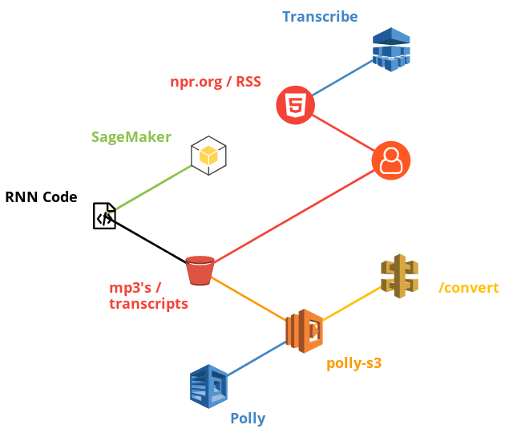
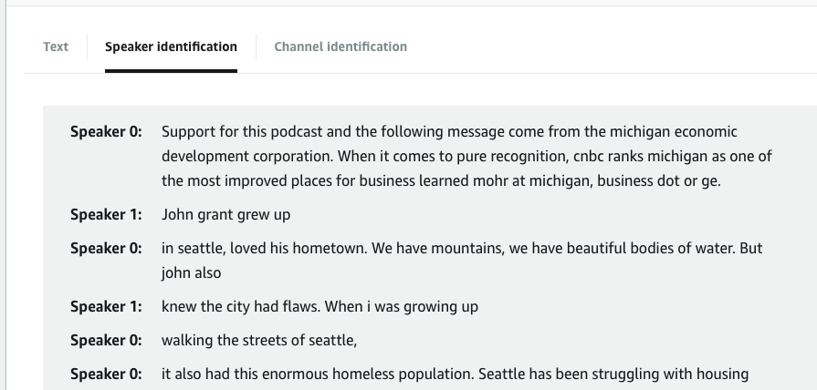
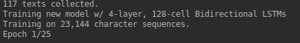

# Planet Money - Podcast Generator

trained text-generating neural network that generates episodes of [Planet Money](https://www.npr.org/sections/money/)

## Architecture



## Audio Example

* [Planet Money RNN - Example 01](https://soundcloud.com/gloverdude/planet-money-rnn-example-01)
* [Planet Money RNN - Example 02](https://soundcloud.com/gloverdude/planet-money-rnn-example-02)

## Learning Example (10 epoch spread)

* **KESTENBAUM**: The the the the the the the the the the the the the the the and a pount and the the the the the the the the the the the the the the the the the to the the the the the the the the the the the the the the the the the the the the the the the the the cong the the the cont and the the the

* **SMITH**: hat the the the the the the and the the the the wat the the the the the the the the the the the that the the the wall the the the the the the the the the the the the wale in the and of the the the the the the to the the the the the the the the the the the the the the the the

* **KESTENBAUM**: And the Norwegian far a proble is a lot of the oil curse. It some of the to get the oil companies in the money and the oil curse. The economy something the oil curse is a lot of the oil curse. The economy gooked the government of the tough to be a cable that the oil curse in the oil co

* **SMITH**: Year as a country we story and the tough that the oil companies in the oil curse. And they don't know the resourt of the oil curse. The is a sayy for a country what the oil curse. The is not to the Norwegian the resourt in the oil curse. It's set it the resournd and what the to get the oil

* **KESTENBAUM**: And in an additional should be 1 percent.

* **SMITH**: Yeah. And it's a little bit is the oil curse is a half and seement the oil curse. The end of that the resource curse.

* **KESTENBAUM**: That's like a 50 percent error or something.

* **SMITH**: Yeah. And it's not even the first numbers of the siduelven and how to the fin in this month that's happening right now, you know, and the manage.

## CloudFormation

### S3

Sync the transcripts to the chosen S3 bucket. If you would like to Scrape these yourself, you can use the `scrape.ipynb` notebook in the coming steps.

```bash
aws s3 mb s3://planet-money-generator --region us-east-1
aws s3 sync transcripts/ s3://planet-money-generator/transcripts
```

### SageMaker

Fill in the `sagemaker-notebook-params.json` file with your desired settings.

```json
[
    {
        "ParameterValue": "ml.m4.xlarge",
        "ParameterKey": "NotebookInstanceType"
    },
    {
        "ParameterValue": "sg-13371337",
        "ParameterKey": "SecurityGroupId"
    },
    {
        "ParameterValue": "subnet-1234123",
        "ParameterKey": "SubnetId"
    },
    {
        "ParameterValue": "planet-money-analysis",
        "ParameterKey": "NotebookInstanceName"
    },
    {
        "ParameterValue": "planet-money-generator",
        "ParameterKey": "SageMakerS3Bucket"
    }
]
```

```bash
aws cloudformation create-stack --stack-name planet-money-sagemaker \
    --template-body file://aws/sagemaker-notebook.json \
    --parameters file://aws/sagemaker-notebook-params.json \
    --capabilities "CAPABILITY_IAM" \
    --disable-rollback
```

## SageMaker Notebook Setup

Upload the contents of `notebooks/` to your SageMaker root directory.


* `scrape.ipynb` - scrape the episode transcripts
* `basic-analysis.ipynb` - train your own text-generating neural network (uses [textgenrnn](https://github.com/minimaxir/textgenrnn))
* `basic-analysis-conversation.ipynb` - train and output a conversation log between reporters
* `planet-money-list.html` - html page for the planet money episodes that we'll use to rip their transcriptions from

## Polly Lambda

To use the Polly text conversion tool, package and upload the lambda as a zip by running the following:

```bash
cd polly-s3
./package-lambda.sh
# Replace this line with your own bucket / path for the zip to sit
aws s3 cp polly-s3.zip s3://waanimals-deployment-scripts/planet-money/polly-s3.zip
```

Deploy the API

```bash
aws cloudformation create-stack --stack-name "planet-money-polly-api" \
    --template-body file://aws/polly-api-gateway.json \
    --parameters file://aws/polly-api-gateway-params.json \
    --capabilities CAPABILITY_IAM
```

Use the output URL example to convert text to voice MP3s

```bash
https://`api-id`.execute-api.us-east-1.amazonaws.com/LATEST/convert?lang=`voice-id`&query=`text-to-convert`
```

## Transcribe Episode



We'll be transcribing one episode for our example, in order to do this we'll have to upload a copy of an episode to S3, then trigger a Transcribe Job.

```bash
# Download an Episode
wget https://play.podtrac.com/npr-510289/npr.mc.tritondigital.com/NPR_510289/media/anon.npr-mp3/npr/pmoney/2018/10/20181031_pmoney_pmpod872.mp3 -O Episode-873-The-Seattle-Experiment.mp3

# Copy to S3
aws s3 cp Episode-873-The-Seattle-Experiment.mp3 s3://planet-money-generator/episodes/Episode-873-The-Seattle-Experiment.mp3

# Delete the Episode
rm Episode-873-The-Seattle-Experiment.mp3
```

Edit the transcribe parameter file in `aws/transcribe-params.json` and then trigger the job

```bash
aws transcribe start-transcription-job \
    --region us-east-1 \
    --cli-input-json file://aws/transcribe-params.json
```

Get the results of the transcription job once its completed by running the following (replace the job name with the one from your parameters)

```bash
aws transcribe get-transcription-job \
    --region us-east-1 \
    --transcription-job-name planet-money-The-Seattle-Experiment
```

Download the results of the transcription using the `TranscriptFileUri` field in the response

```json
{
    "TranscriptionJob": {
        ...
        "Transcript": {
            "TranscriptFileUri": "<DOWNLOAD-URL-HERE>"
        },
        ...
    }
}
```

## Why?

This is our own spin on the prolific generative text deep learning models that have been made to [write tweets](https://twitter.com/internetshit_nn), [write new episodes of F.R.I.E.N.D.S](https://twitter.com/_Pandy/status/689209034143084547) and even generate [song lyrics](https://medium.com/@ivanliljeqvist/using-ai-to-generate-lyrics-5aba7950903).

We decided that podcasts are kind of popular right now, so we wanted to create our own. Rather than go to the effort of being interesting or learn to talk into a microphone for more than 5 minutes, we decided to use a computer to generate a podcast script and have AWS Polly read it out for us.

## How?

We used AWS Transcribe to injest audio from other podcasts with far more interesting hosts, outputting a text transcription. This text transcription was used as training data for a deep learning generative text model based on [textgenrnn](https://github.com/minimaxir/textgenrnn). This model was then used to generate a simple 20 line script, which was read by two announcers using AWS Polly.

### Neural Network Architecture


We limited ourselves to using a single episode as training data because we were designing this to be unintentionally funny with the errors that it made rather than trying to create something of real value.

We used our favourite podcast, Planet Money as the training data, but this process could easily be applied to any other podcast.

## Execution on Local Hardware

Due to time constraints (We only started this two days before the deadline) we were unable to request GPU instances from AWS Support in time, so rather than using a 'ml.p2.xlarge' instance via SageMaker, we ran our model training process on a laptop GPU (Nvidia 970m).

Using the Planet Money episode "[Norway Has Advice For Libya"](https://www.npr.org/sections/money/2011/08/26/139972557/the-friday-podcast-norways-got-advice-for-libya) as training data, this process took 182 seconds to complete 25 epochs, which is perfectly reasonable for a laptop GPU from 2014.


